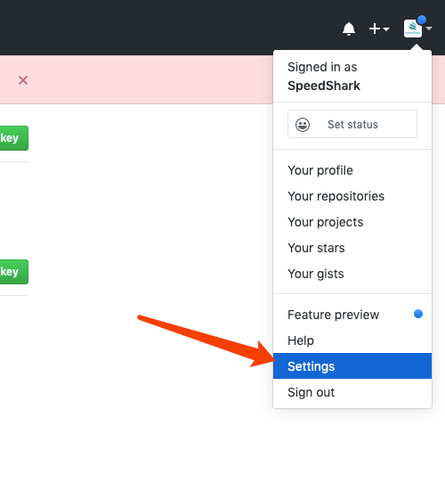
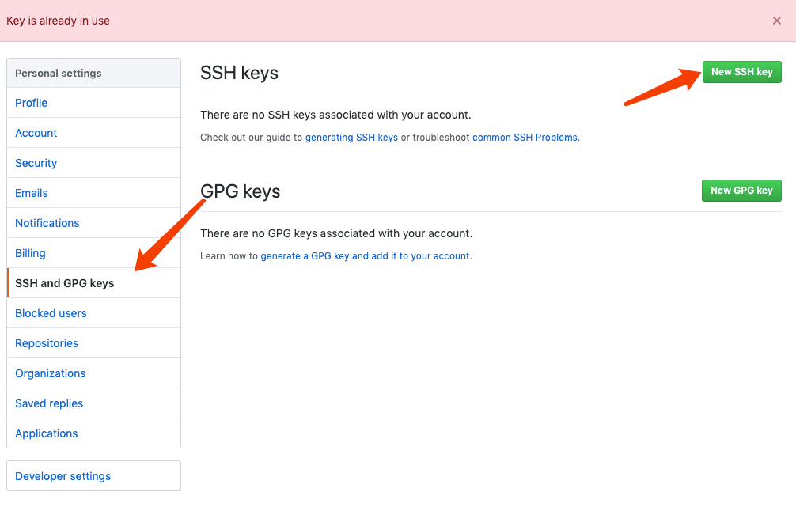
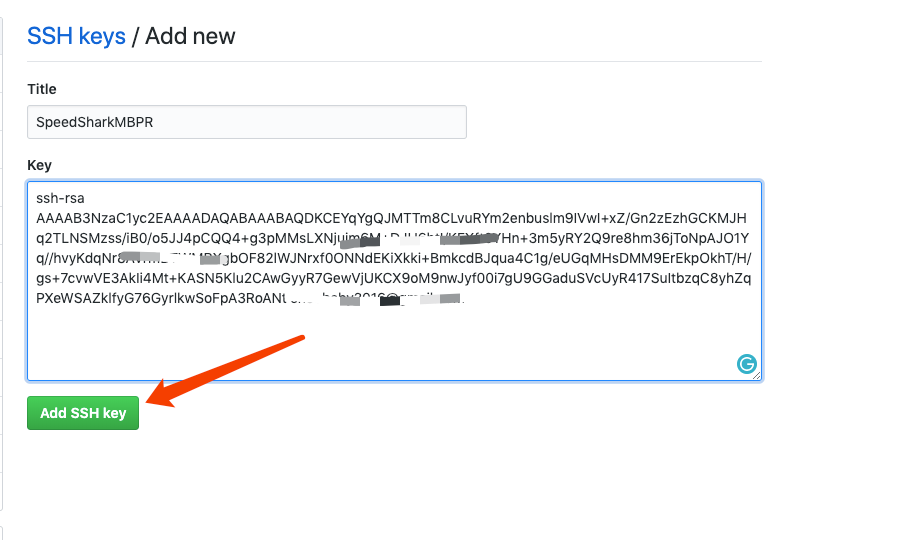
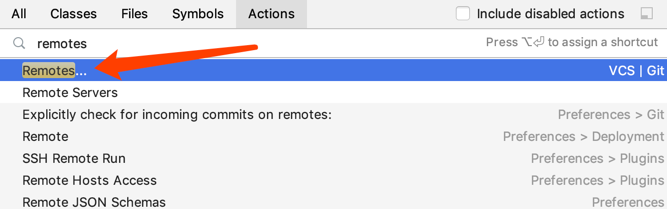
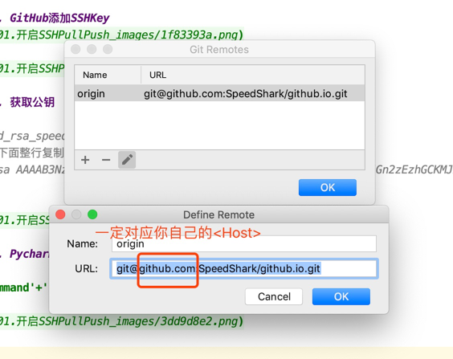
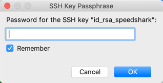

## 01. MacOS SSHkey Pull Push GitHub

> Win/Linux/MacOS原理相同

### 1. 添加SSHkey
````
-----一路回车-------------------------
ssh-keygen -t rsa -C "speedshark@github.io"
Generating public/private rsa key pair.
Enter file in which to save the key (/Users/speedshark/.ssh/id_rsa):
Enter passphrase (empty for no passphrase): 
Enter same passphrase again: 
Your identification has been saved in id_rsa.
Your public key has been saved in id_rsa.pub.
The key fingerprint is:
SHA256:UOD5esctq7hGOpmKkw828E0ObO6NxDhKA1gX52rt0Os speedshark@github.io
The key's randomart image is:
+---[RSA 2048]----+
|    . o..        |
|     = o         |
|  . . =          |
|.o . + o         |
|+ + = o S        |
|o* * o.o . .     |
|+*= o=+ . + .    |
|**oo=..o . o     |
|oo=..oE....      |
+----[SHA256]-----+
````


### 2. 添加第二个SSHkey

> GitHub用默认的 id_rsa Key
> 公司用 id_rsa_gitlab Key
> MacOS同Linux 文件路径 ~/用户名/.ssh/

````
# 备份sshkey 万一挂了可补救
mkdir -p ~/.ssh/sshkeybackup/
cp ~/.ssh/*.* ~/speedshark/.ssh/sshkeybackup/
-----生成Key同上-------------------------
ssh-keygen -t rsa -C "speedshark@gitlab"
Generating public/private rsa key pair.
-----一定要另存其他名称私钥-------------------------
Enter file in which to save the key (/Users/speedshark/.ssh/id_rsa):id_rsa_gitlab
-----密码看你自己吧可有可无-------------------------
Enter passphrase (empty for no passphrase): 
Enter same passphrase again: 
Your identification has been saved in id_rsa_gitlab.
Your public key has been saved in id_rsa_gitlab.pub.
The key fingerprint is:
SHA256:UOD5esctq7hGOpmKkw828E0ObO6NxDhKA1gX52rt0Os speedshark@gitlab
The key's randomart image is:
+---[RSA 2048]----+
|    . o..        |
|     = o         |
|  . . =          |
|.o . + o         |
|+ + = o S        |
|o* * o.o . .     |
|+*= o=+ . + .    |
|**oo=..o . o     |
|oo=..oE....      |
+----[SHA256]-----+

# 生成配置文件
cat > ~/.ssh/config <<EOF
# github
Host github.com
HostName github.com
PreferredAuthentications publickey
IdentityFile ~/.ssh/id_rsa

# gitlab
Host gitlab.com
HostName gitlab.com
PreferredAuthentications publickey
IdentityFile ~/.ssh/id_rsa_gitlab
EOF

# 后台运行
eval "$(ssh-agent -s)"

# 添加多个key
ssh-add -K ~/.ssh/id_rsa
Identity added: /Users/speedshark/.ssh/id_rsa (speenshark@github.io)
ssh-add -K ~/.ssh/id_rsa_gitlab
Enter passphrase for /Users/shilei/.ssh/id_rsa_gitlab:
Identity added: /Users/shilei/.ssh/id_rsa_gitlab (speenshark@gitlab)

# 验证账号
-----ssh -T <Host> #看自己的config文件-------------------------
ssh -T git@github.com 
Hi speedshark! You've successfully authenticated, but GitHub does not provide shell access.
ssh -T git@gitlib.com           
Hi speedshark! You've successfully authenticated, but GitHub does not provide shell access.
````

### 3. GitHub添加SSHKey




### 4. 获取公钥
````
cat id_rsa_speedshark.pub
-----下面整行复制-------------------------
ssh-rsa AAAAB3NzaC1yc2EAADKCEYqYgQJMTTm8CLvuRYm2enbuslm9IVwI+xZ/Gn2zEzhGCKMJHq2TLNSMzss/iB0/o5JJ4pCQQ4+g3pMMsLXNjuim6M+DJH6btI/KFXft0YHn+3m5yRY2Q9re8hm36jToNpAJO1Yq//hvyKdqNr8AVrmBTWMRXgbOF82lWJNrxf0ONNdEKiXkki+BmkcdBJqua4C1g/eUGqMHsDMM9ErEkpOkhT/H/gs+7cvwVE3AkIi4Mt+KASN5Klu2CAwGyyR7GewVjUKCX9oM9nwJyf00i7gU9GGaduSVcUyR417SuItbzqC8yhZqPXeWSAZklfyG76GyrlkwSoFpA3RoANt speedshark@github.io
````



### 5. Pycharm设置

> 'command'+'shift'+'a'







## END


